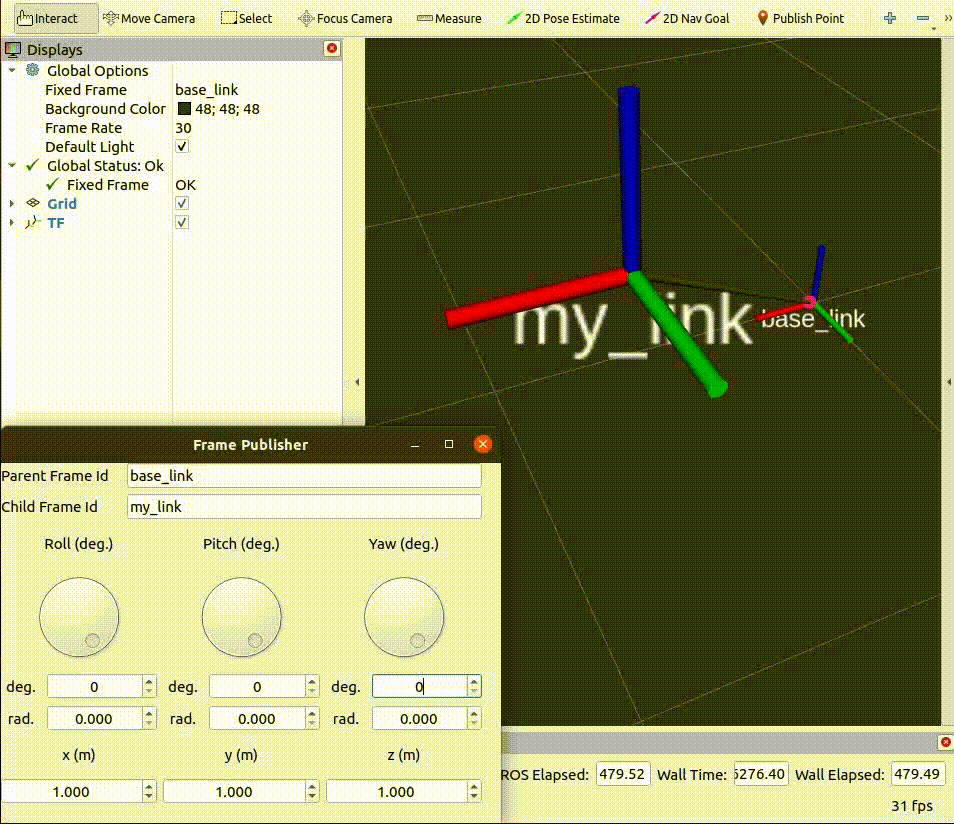

# frame_publisher

3D rotations are complex. This simple tool is designed to publish TF frames. Thus it can help in finding the correct rotation based on Euler angles.

    
     
    Demonstration on RViz

## Dependencies
* `pyqt5`: Install it using `sudo apt install python3-pyqt5`

## Run
$ source devel/setup.bash

## Test Configuration
* This package has been tested on ROS Noetic (Ubuntu 20.04.6 LTS)

## Issues (or Error Reporting) 
Please check [here](https://github.com/ravijo/frame_publisher/issues) and create issues accordingly.

