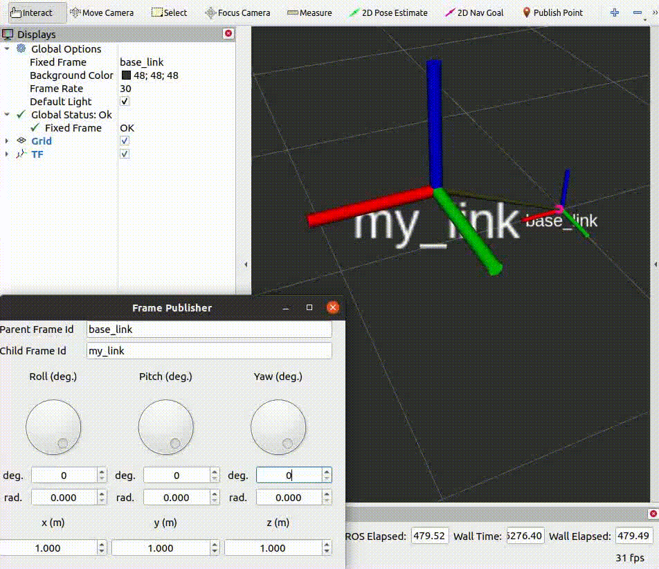

# frame_publisher

3D rotations are complex. This simple tool is designed to publish TF frames. Thus it can help in finding the correct rotation based on Euler angles.


</br>


<p align="center">
    
    </br>
    <sup>Demonstration on RViz</sup>
</p>


## Dependencies
* `pyqt5`: Install it using `sudo apt install python3-pyqt5`


## Installation
1. Download or clone the repository to the source directory of ROS workspace
1. Compile the workspace by using `catkin_make`


## Run
```console
$ source devel/setup.bash
$ roslaunch frame_publisher run.launch
```


## Test Configuration
* This package has been tested on ROS Noetic (Ubuntu 20.04.6 LTS)


## Issues (or Error Reporting) 
Please check [here](https://github.com/ravijo/frame_publisher/issues) and create issues accordingly.
